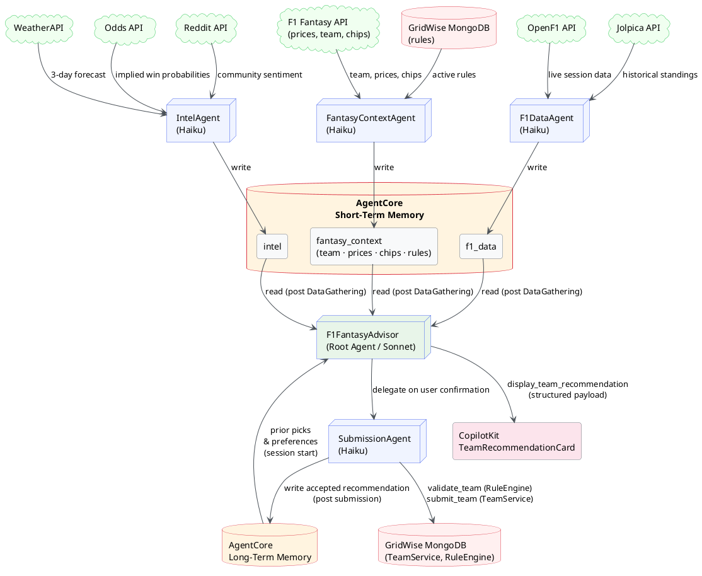
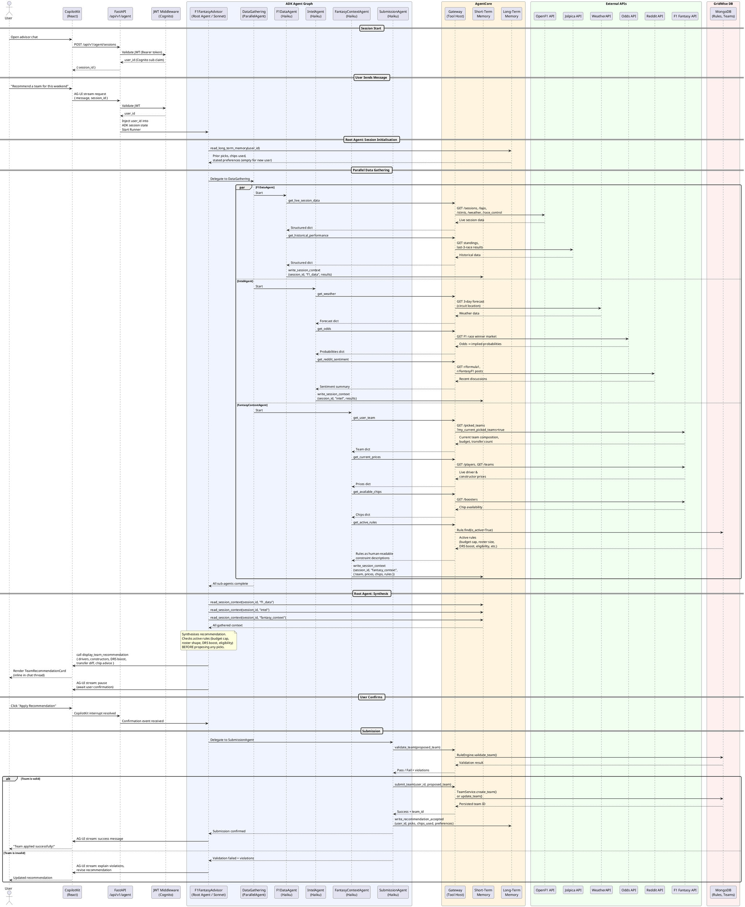

# AI Advisor Agent Flow

Multi-agent architecture for the F1 Fantasy AI Advisor. Powered by Google ADK embedded in the FastAPI service, using AWS AgentCore for memory and gateway infrastructure.

---

## Activity Diagram

End-to-end user journey from opening the chat to a submitted team, including all decision branches.

```plantuml
@startuml
skinparam ActivityBackgroundColor #F8F9FA
skinparam ActivityBorderColor #6C757D
skinparam ActivityDiamondBackgroundColor #FFF3CD
skinparam ActivityDiamondBorderColor #FFC107
skinparam ArrowColor #495057
skinparam roundcorner 8

start

:User opens /advisor page;
:Frontend calls POST /api/v1/agent/sessions;

if (JWT valid?) then (no)
  #FFB3B3:Return 401 Unauthorized;
  stop
else (yes)
  :Extract user_id from Cognito sub claim;
  :Inject user_id into ADK session state;
  :Return session_id to frontend;
endif

:User sends recommendation request;
:Root agent (F1FantasyAdvisor) starts;

:Read long-term memory\n(prior picks, chip history, preferences);

note right
  Empty for new users.
  Informs root agent of past decisions
  before data gathering begins.
end note

fork
  :F1DataAgent;
  :get_live_session_data (OpenF1);
  :get_historical_performance (Jolpica);
  :Write → short-term memory "f1_data";
fork again
  :IntelAgent;
  :get_weather (WeatherAPI);
  :get_odds (Odds API);
  :get_reddit_sentiment (Reddit);
  :Write → short-term memory "intel";
fork again
  :FantasyContextAgent;
  :get_user_team (F1 Fantasy API);
  :get_current_prices (F1 Fantasy API);
  :get_available_chips (F1 Fantasy API);
  :get_active_rules (GridWise MongoDB);
  :Write → short-term memory "fantasy_context"\n(team + prices + chips + rules);
end fork

if (All sub-agents succeeded?) then (partial failure)
  :Note unavailable data sources;
  :Proceed with reduced confidence;
else (yes)
endif

:Root agent reads all three\nshort-term memory keys;

:Check active rules from fantasy_context\n(budget cap, roster shape, DRS boost,\neligibility constraints);

note right
  Rules are checked BEFORE
  synthesising any picks.
  Prevents rule violations at
  the recommendation stage.
end note

:Synthesise team recommendation\n(5 drivers, 2 constructors, DRS boost,\ntransfer diff, chip advice);

:Call display_team_recommendation →\nCopilotKit renders TeamRecommendationCard;

if (User confirms recommendation?) then (declines / asks to revise)
  :Root agent adjusts recommendation\nbased on user feedback;
  :Re-display updated card;
  if (User confirms revised recommendation?) then (declines again)
    :End session without submission;
    stop
  else (confirms)
  endif
else (confirms)
endif

:Delegate to SubmissionAgent;
:validate_team via RuleEngine;

if (Team passes validation?) then (violations found)
  note right
    Edge case — should rarely occur
    since rules were checked at synthesis.
    Triggered by price drift or
    arithmetic errors.
  end note
  :Return violations to root agent;
  :Root agent revises recommendation;
  :Re-display updated card;
  :validate_team again;
else (valid)
endif

:submit_team via TeamService;

if (Submission successful?) then (error)
  #FFB3B3:Surface error in chat thread;
  stop
else (success)
endif

:Write to long-term memory\n(accepted picks, chips used, preferences);

#B3FFB3:Show success message in chat thread;

stop
@enduml
```

---

## Data Flow Diagram

How data moves through the agent graph — from external APIs through short-term memory to the root agent's synthesis and final submission.

---

## Full Session Flow

## Agent Roles

| Agent | Model | Tools | Memory Write |
|---|---|---|---|
| `F1FantasyAdvisor` | Claude Sonnet (Bedrock) | — (delegates only) | Reads long-term at start |
| `F1DataAgent` | Claude Haiku (Bedrock) | `get_live_session_data`, `get_historical_performance` | `f1_data` → short-term |
| `IntelAgent` | Claude Haiku (Bedrock) | `get_weather`, `get_odds`, `get_reddit_sentiment` | `intel` → short-term |
| `FantasyContextAgent` | Claude Haiku (Bedrock) | `get_user_team`, `get_current_prices`, `get_available_chips`, `get_active_rules` | `fantasy_context` → short-term |
| `SubmissionAgent` | Claude Haiku (Bedrock) | `validate_team`, `submit_team` | `recommendation_accepted` → long-term |

## Tool Sources

| Tool | Source | Auth |
|---|---|---|
| `get_live_session_data` | OpenF1 API | None (public) |
| `get_historical_performance` | Jolpica API | None (public) |
| `get_weather` | WeatherAPI | API key (Secrets Manager) |
| `get_odds` | The Odds API | API key (Secrets Manager) |
| `get_reddit_sentiment` | Reddit OAuth API | Client credentials (Secrets Manager) |
| `get_user_team` | F1 Fantasy API | F1 session token (Secrets Manager) |
| `get_current_prices` | F1 Fantasy API | None (public endpoint) |
| `get_available_chips` | F1 Fantasy API | F1 session token (Secrets Manager) |
| `get_active_rules` | GridWise MongoDB | None (internal) |
| `validate_team` | GridWise RuleEngine | None (internal) |
| `submit_team` | GridWise TeamService | None (internal) |

## Key Design Decisions

- **`user_id` is never an LLM argument** — extracted from JWT in FastAPI middleware and injected directly into ADK session state before the Runner starts. Tools read it from session context, preventing prompt injection attacks.
- **Rules loaded before synthesis** — `get_active_rules` runs in parallel during `FantasyContextAgent`. Root agent reads rules from short-term memory before proposing any picks, eliminating the validate→revise loop for rule violations.
- **`validate_team` is a safety net, not the primary constraint** — the agent already knows the rules. Validation at submission time catches edge cases (price drift, arithmetic errors) not reasoning failures.
- **Long-term memory written only on accepted recommendations** — past picks, chip usage, and stated preferences are persisted after `submit_team` succeeds. Sessions where no team is submitted leave long-term memory unchanged.
