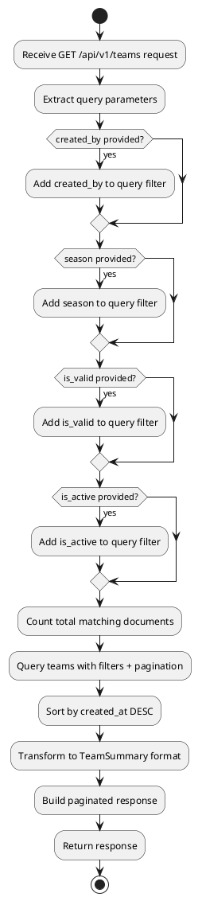

# Phase 2.2: View Teams (Backend) - US-1.1

## Overview
Implement GET endpoints for listing all teams and viewing individual team details.

**User Story:** US-1.1 - As a user, I want to view all my fantasy teams in a dashboard
**Epic:** Epic 1 - Team Management
**Estimated Effort:** 3-4 hours

---

## Objectives

1. ✅ Implement GET /api/v1/teams (list all teams)
2. ✅ Implement GET /api/v1/teams/{team_id} (get single team)
3. ✅ Add filtering capabilities (by season, validity, user)
4. ✅ Add pagination support
5. ✅ Include validation status in responses
6. ✅ Write integration tests

---

## API Endpoints Design

### 1. GET /api/v1/teams
**Purpose:** List all teams with optional filtering and pagination

**Query Parameters:**
- `created_by` (optional): Filter by user ID
- `season` (optional): Filter by season year
- `is_valid` (optional): Filter by validation status (true/false)
- `is_active` (optional): Filter by active status (true/false)
- `skip` (default: 0): Pagination offset
- `limit` (default: 20, max: 100): Number of results

**Response:**
```json
{
  "total": 15,
  "skip": 0,
  "limit": 20,
  "teams": [
    {
      "team_id": "...",
      "team_name": "My Team",
      "season": 2026,
      "budget_used": 98.5,
      "budget_remaining": 1.5,
      "is_valid": true,
      "driver_count": 5,
      "constructor_count": 2,
      "created_at": "...",
      "updated_at": "..."
    }
  ]
}
```

### 2. GET /api/v1/teams/{team_id}
**Purpose:** Get detailed information about a specific team

**Response:**
```json
{
  "team_id": "...",
  "team_name": "My Team",
  "season": 2026,
  "drivers": [...],
  "constructors": [...],
  "drs_boost_driver_id": "...",
  "budget_cap": 100.0,
  "budget_used": 98.5,
  "budget_remaining": 1.5,
  "is_valid": true,
  "validation_errors": [],
  "transfer_history": [...],
  "created_at": "...",
  "updated_at": "..."
}
```

---

## Implementation Approach

### Pseudocode - List Teams Endpoint

```python
async def get_all_teams(filters, pagination):
    # 1. Build MongoDB query from filters
    query = {}
    if filters.created_by:
        query["created_by"] = filters.created_by
    if filters.season:
        query["season"] = filters.season
    if filters.is_valid is not None:
        query["is_valid"] = filters.is_valid
    if filters.is_active is not None:
        query["is_active"] = filters.is_active

    # 2. Get total count for pagination metadata
    total_count = await FantasyTeam.count(query)

    # 3. Query teams with pagination
    teams = await FantasyTeam.find(query)
        .skip(pagination.skip)
        .limit(pagination.limit)
        .sort("-created_at")  # Most recent first
        .to_list()

    # 4. Transform to summary format (lighter response)
    teams_summary = [
        {
            "team_id": team.team_id,
            "team_name": team.team_name,
            "season": team.season,
            "budget_used": team.budget_used,
            "budget_remaining": team.budget_remaining,
            "is_valid": team.is_valid,
            "driver_count": len(team.drivers),
            "constructor_count": len(team.constructors),
            "created_at": team.created_at,
            "updated_at": team.updated_at
        }
        for team in teams
    ]

    # 5. Return paginated response
    return {
        "total": total_count,
        "skip": pagination.skip,
        "limit": pagination.limit,
        "teams": teams_summary
    }
```

### Pseudocode - Get Single Team Endpoint

```python
async def get_team_by_id(team_id: str):
    # 1. Query team by ID
    team = await FantasyTeam.find_one({"team_id": team_id})

    # 2. If not found, raise 404
    if not team:
        raise HTTPException(404, "Team not found")

    # 3. Return full team details
    return team
```

---

## Files to Create/Modify

### New Files
- `service/app/schemas/team.py` - Add `TeamListResponse`, `TeamSummary` schemas
- `service/tests/test_api/test_teams_read.py` - Integration tests

### Modified Files
- `service/app/routers/teams.py` - Add GET endpoints
- `service/app/schemas/team.py` - Add response schemas

---

## Response Schema Design

### TeamSummary (for list view)
```
TeamSummary:
  - team_id: str
  - team_name: str
  - season: int
  - budget_used: float
  - budget_remaining: float
  - is_valid: bool
  - driver_count: int
  - constructor_count: int
  - created_at: datetime
  - updated_at: datetime
```

### TeamDetail (for single team view)
```
TeamDetail:
  - All fields from FantasyTeam model
  - Includes full driver and constructor details
  - Includes validation errors if any
  - Includes transfer history
```

### PaginatedTeamsResponse
```
PaginatedTeamsResponse:
  - total: int (total count of teams matching filters)
  - skip: int (pagination offset)
  - limit: int (page size)
  - teams: List[TeamSummary]
```

---

## Filtering Logic Flow



---

## Testing Strategy

### Test Cases

**List Teams:**
1. Get all teams without filters → Returns all teams
2. Filter by season → Returns only teams for that season
3. Filter by is_valid=true → Returns only valid teams
4. Filter by is_valid=false → Returns only invalid teams
5. Filter by created_by → Returns only teams for that user
6. Pagination works correctly → Returns correct page of results
7. Total count is accurate
8. Empty result set returns empty array

**Get Single Team:**
1. Get team with valid ID → Returns full team details
2. Get team with invalid ID → Returns 404
3. Response includes all drivers and constructors
4. Response includes DRS Boost selection
5. Response includes validation status

### Integration Test Pseudocode

```python
test_get_all_teams():
    # Create 3 teams in database
    # GET /api/v1/teams
    # Assert: status_code = 200
    # Assert: total = 3
    # Assert: teams array has 3 items
    # Assert: each team has required summary fields

test_filter_by_season():
    # Create teams for seasons 2025, 2026
    # GET /api/v1/teams?season=2026
    # Assert: all returned teams have season=2026

test_pagination():
    # Create 25 teams
    # GET /api/v1/teams?skip=0&limit=10
    # Assert: returns first 10 teams
    # GET /api/v1/teams?skip=10&limit=10
    # Assert: returns next 10 teams

test_get_team_by_id():
    # Create a team
    # GET /api/v1/teams/{team_id}
    # Assert: status_code = 200
    # Assert: team_id matches
    # Assert: has drivers array with 5 items
    # Assert: has constructors array with 2 items

test_get_nonexistent_team():
    # GET /api/v1/teams/fake-id
    # Assert: status_code = 404
```

---

## Database Indexes

Ensure these indexes exist on the `teams` collection:
- `team_id` (unique)
- `created_by`
- `season`
- `is_valid`
- `is_active`
- `created_at` (for sorting)

---

## Verification Checklist

- [ ] GET /api/v1/teams returns all teams
- [ ] Pagination works (skip/limit)
- [ ] Filter by created_by works
- [ ] Filter by season works
- [ ] Filter by is_valid works
- [ ] Filter by is_active works
- [ ] Total count is accurate
- [ ] Teams sorted by created_at DESC
- [ ] GET /api/v1/teams/{team_id} returns full details
- [ ] 404 for non-existent team ID
- [ ] All tests pass

---

## Next Steps

After view teams is complete:
1. Proceed to Phase 2.3: Update Team (Backend)
2. Implement team update endpoint with transfer tracking
