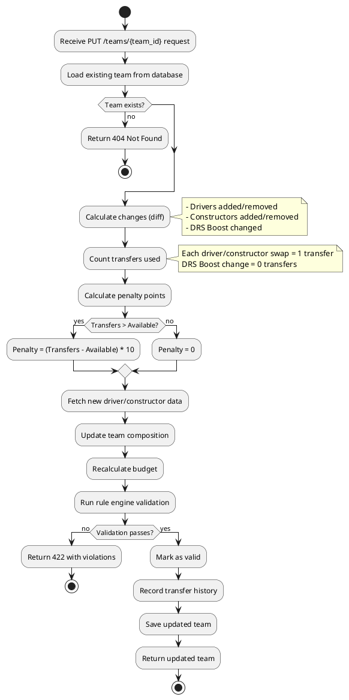
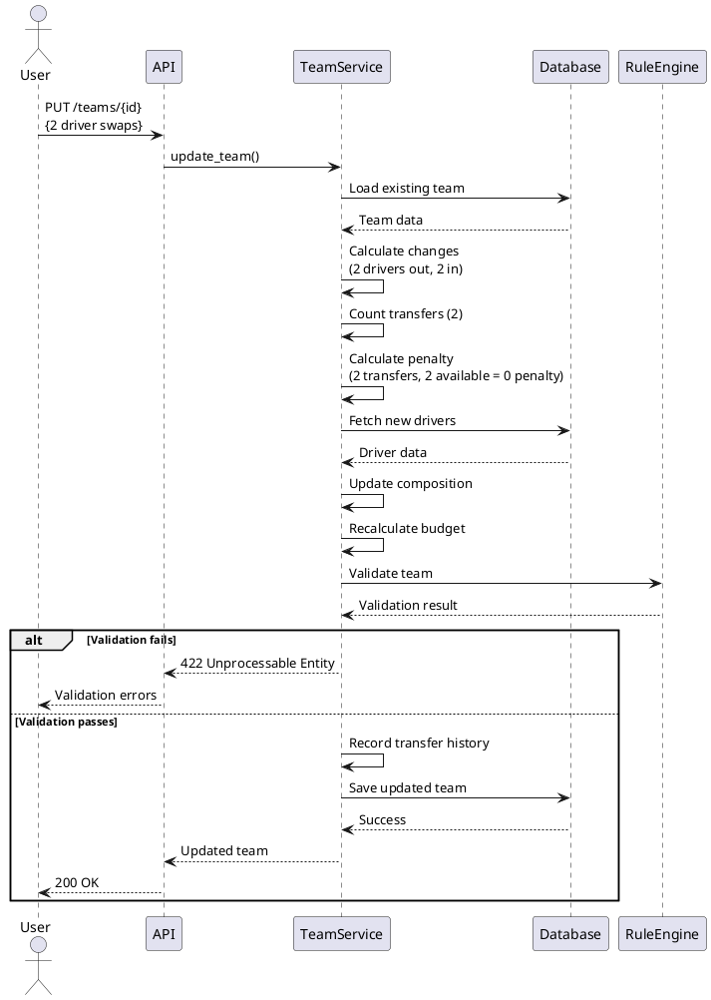

# Phase 2.3: Update Team (Backend) - US-1.3

## Overview
Implement PUT /api/v1/teams/{team_id} endpoint with transfer tracking, penalty calculation, and re-validation.

**User Story:** US-1.3 - As a user, I want to update my fantasy team with transfer tracking
**Epic:** Epic 1 - Team Management
**Estimated Effort:** 6-8 hours

---

## Objectives

1. ✅ Implement PUT /api/v1/teams/{team_id} endpoint
2. ✅ Track driver/constructor changes (transfers)
3. ✅ Calculate transfer penalties (-10 points per excess transfer)
4. ✅ Handle DRS Boost changes
5. ✅ Re-validate team after updates
6. ✅ Recalculate budget
7. ✅ Store transfer history
8. ✅ Write comprehensive tests

---

## Transfer Rules

### F1 Fantasy Transfer Logic
- **Free transfers per race:** 2
- **Carry-over:** Max 1 unused transfer to next race (total 3 max)
- **Penalty:** -10 points per transfer beyond available transfers
- **Transfer types:** Driver swap, Constructor swap, DRS Boost change (free)

---

## Team Update Flow



---

## Implementation Approach

### Main Update Logic Pseudocode

```python
async def update_team(
    team_id: str,
    new_driver_ids: List[str],
    new_constructor_ids: List[str],
    new_drs_boost_driver_id: str
) -> FantasyTeam:
    """
    Update team with transfer tracking.

    Steps:
    1. Load existing team
    2. Calculate what changed
    3. Count transfers
    4. Calculate penalty
    5. Fetch new entity data
    6. Update team
    7. Recalculate budget
    8. Validate
    9. Record history
    10. Save
    """

    # Step 1: Load existing team
    team = await load_team_or_404(team_id)

    # Step 2: Calculate changes
    changes = calculate_changes(
        old_drivers=[d.driver_id for d in team.drivers],
        new_drivers=new_driver_ids,
        old_constructors=[c.constructor_id for c in team.constructors],
        new_constructors=new_constructor_ids
    )

    # Step 3: Count transfers (driver/constructor swaps only)
    transfer_count = len(changes.drivers_removed) + len(changes.constructors_removed)

    # Step 4: Calculate penalty
    penalty = calculate_transfer_penalty(
        transfers_used=transfer_count,
        available_transfers=team.available_transfers
    )

    # Step 5: Fetch new entity data from database
    new_drivers_data = await fetch_and_validate_drivers(new_driver_ids)
    new_constructors_data = await fetch_and_validate_constructors(new_constructor_ids)

    # Step 6: Update team composition
    team.drivers = new_drivers_data
    team.constructors = new_constructors_data
    team.drs_boost_driver_id = new_drs_boost_driver_id

    # Step 7: Recalculate budget
    team.calculate_budget()

    # Step 8: Validate against all rules
    validation_result = await validate_team_against_rules(team)
    if not validation_result.is_valid:
        raise ValidationError(validation_result.violations)

    # Step 9: Record transfer history
    transfer_record = create_transfer_record(
        changes=changes,
        transfers_used=transfer_count,
        transfers_available=team.available_transfers,
        penalty_points=penalty
    )
    team.transfer_history.append(transfer_record)
    team.current_race_transfers = transfer_count

    # Step 10: Save and return
    team.is_valid = True
    team.updated_at = now()
    await team.save()

    return team
```

### Calculate Changes Pseudocode

```python
def calculate_changes(old_drivers, new_drivers, old_constructors, new_constructors):
    """
    Calculate what entities were added/removed.

    Returns:
        Changes object with:
        - drivers_removed: List[str]
        - drivers_added: List[str]
        - constructors_removed: List[str]
        - constructors_added: List[str]
    """

    old_driver_set = set(old_drivers)
    new_driver_set = set(new_drivers)

    drivers_removed = old_driver_set - new_driver_set
    drivers_added = new_driver_set - old_driver_set

    old_constructor_set = set(old_constructors)
    new_constructor_set = set(new_constructors)

    constructors_removed = old_constructor_set - new_constructor_set
    constructors_added = new_constructor_set - old_constructor_set

    return Changes(
        drivers_removed=list(drivers_removed),
        drivers_added=list(drivers_added),
        constructors_removed=list(constructors_removed),
        constructors_added=list(constructors_added)
    )
```

### Calculate Penalty Pseudocode

```python
def calculate_transfer_penalty(transfers_used: int, available_transfers: int) -> int:
    """
    Calculate penalty points for excess transfers.

    Formula: max(0, transfers_used - available_transfers) * 10

    Examples:
    - 1 transfer, 2 available = 0 penalty
    - 2 transfers, 2 available = 0 penalty
    - 3 transfers, 2 available = 10 penalty (1 excess)
    - 5 transfers, 2 available = 30 penalty (3 excess)
    """

    if transfers_used <= available_transfers:
        return 0

    excess = transfers_used - available_transfers
    penalty = excess * 10

    return penalty
```

---

## Update Scenarios Sequence Diagram



---

## Transfer History Data Structure

```python
TransferRecord:
    race_id: Optional[str]           # Which race (None for MVP)
    transfers_used: int              # Number of transfers made
    transfers_available: int         # How many were available
    penalty_points: int              # Penalty incurred
    changes: List[Change]            # What changed
    timestamp: datetime              # When update happened

Change:
    type: str                        # "driver_out", "driver_in", "constructor_out", "constructor_in"
    entity_id: str                   # Driver/Constructor ID
    entity_name: str                 # Display name
    price: float                     # Price at time of change
```

### Example Transfer Record

```json
{
  "race_id": null,
  "transfers_used": 2,
  "transfers_available": 2,
  "penalty_points": 0,
  "changes": [
    {
      "type": "driver_out",
      "entity_id": "driver-123",
      "entity_name": "Logan Sargeant",
      "price": 15.0
    },
    {
      "type": "driver_in",
      "entity_id": "driver-456",
      "entity_name": "Liam Lawson",
      "price": 16.5
    },
    {
      "type": "constructor_out",
      "entity_id": "constructor-789",
      "entity_name": "Haas",
      "price": 15.0
    },
    {
      "type": "constructor_in",
      "entity_id": "constructor-012",
      "entity_name": "Alpine",
      "price": 18.5
    }
  ],
  "timestamp": "2026-03-15T14:30:00Z"
}
```

---

## Files to Create/Modify

### New Files
- `service/app/services/transfer_service.py` - Transfer calculation logic
- `service/app/schemas/transfer.py` - Transfer-related schemas
- `service/tests/test_services/test_transfer_service.py` - Transfer logic tests
- `service/tests/test_api/test_teams_update.py` - Update endpoint tests

### Modified Files
- `service/app/services/team_service.py` - Add `update_team()` method
- `service/app/routers/teams.py` - Add PUT endpoint
- `service/app/schemas/team.py` - Add `TeamUpdate` schema
- `service/app/models/team.py` - Ensure `transfer_history` field exists

---

## API Contract

### Request Schema
```python
TeamUpdate:
    driver_ids: List[str]           # Exactly 5, validated
    constructor_ids: List[str]      # Exactly 2, validated
    drs_boost_driver_id: str        # Must be one of driver_ids
```

### Success Response (200 OK)
```json
{
  "team_id": "abc-123",
  "team_name": "My Team",
  "season": 2026,
  "drivers": [...],
  "constructors": [...],
  "drs_boost_driver_id": "driver-456",
  "budget_used": 97.5,
  "budget_remaining": 2.5,
  "is_valid": true,
  "validation_errors": [],
  "transfer_history": [
    {
      "transfers_used": 2,
      "transfers_available": 2,
      "penalty_points": 0,
      "changes": [...],
      "timestamp": "2026-03-15T14:30:00Z"
    }
  ],
  "current_race_transfers": 2,
  "available_transfers": 2,
  "updated_at": "2026-03-15T14:30:00Z"
}
```

### Error Responses

**404 Not Found:**
```json
{
  "detail": "Team abc-123 not found"
}
```

**422 Validation Error:**
```json
{
  "detail": {
    "code": "RULE_VIOLATION",
    "message": "Team validation failed",
    "violations": [
      {
        "rule_name": "Budget Cap Rule",
        "message": "Budget exceeded: 105.5M / 100.0M",
        "severity": "error",
        "details": {...}
      }
    ]
  }
}
```

---

## Testing Strategy

### Unit Tests - Transfer Service

```python
test_calculate_changes_driver_swap():
    # Given: Team with drivers A,B,C,D,E
    # When: Update to drivers A,B,C,D,F (swap E for F)
    # Then: changes.drivers_removed = [E], changes.drivers_added = [F]

test_calculate_changes_no_change():
    # Given: Team with drivers A,B,C,D,E
    # When: Update to same drivers A,B,C,D,E
    # Then: changes.drivers_removed = [], changes.drivers_added = []

test_calculate_penalty_within_limit():
    # Given: 2 transfers, 2 available
    # When: calculate_penalty()
    # Then: penalty = 0

test_calculate_penalty_one_excess():
    # Given: 3 transfers, 2 available
    # When: calculate_penalty()
    # Then: penalty = 10

test_calculate_penalty_multiple_excess():
    # Given: 5 transfers, 2 available
    # When: calculate_penalty()
    # Then: penalty = 30
```

### Integration Tests - Update Endpoint

```python
test_update_team_single_driver_swap_success():
    # Create team with 5 drivers
    # Update: swap 1 driver
    # Assert: status = 200
    # Assert: team.drivers updated
    # Assert: transfer_history has 1 record
    # Assert: penalty = 0

test_update_team_multiple_swaps_no_penalty():
    # Create team
    # Update: swap 2 drivers
    # Assert: status = 200
    # Assert: penalty = 0 (within limit)

test_update_team_excess_transfers_penalty():
    # Create team with available_transfers = 2
    # Update: swap 3 drivers
    # Assert: status = 200 (still succeeds, but with penalty)
    # Assert: penalty = 10
    # Assert: transfer_history shows penalty

test_update_drs_boost_only_no_transfer():
    # Create team
    # Update: same drivers, different DRS driver
    # Assert: transfer_count = 0
    # Assert: penalty = 0

test_update_budget_exceeded_fails():
    # Create team
    # Update: swap cheap driver for expensive (exceeds budget)
    # Assert: status = 422
    # Assert: violation mentions budget

test_update_nonexistent_team_404():
    # Update: team with fake ID
    # Assert: status = 404

test_update_inactive_driver_fails():
    # Update: include inactive driver
    # Assert: status = 422
    # Assert: validation error about driver eligibility
```

---

## Transfer Penalty Calculation Examples

```
Available Transfers: 2 (default per race)

Scenario 1: 0 transfers
- Penalty = max(0, 0 - 2) * 10 = 0

Scenario 2: 1 transfer
- Penalty = max(0, 1 - 2) * 10 = 0

Scenario 3: 2 transfers (at limit)
- Penalty = max(0, 2 - 2) * 10 = 0

Scenario 4: 3 transfers (1 excess)
- Penalty = max(0, 3 - 2) * 10 = 10 points

Scenario 5: 4 transfers (2 excess)
- Penalty = max(0, 4 - 2) * 10 = 20 points

Scenario 6: 5 transfers (3 excess, "wildcard")
- Penalty = max(0, 5 - 2) * 10 = 30 points
```

---

## Edge Cases to Handle

1. **No changes made** → Transfer count = 0, no history record added
2. **Same driver swapped twice** → Should not be possible (validation)
3. **DRS Boost to non-selected driver** → Validation error
4. **Update while team is invalid** → Allow update, re-validate
5. **Concurrent updates** → Last write wins (acceptable for MVP)

---

## Verification Checklist

- [x] PUT endpoint exists and routes correctly
- [x] Load existing team or return 404
- [x] Calculate changes accurately (set difference)
- [x] Count transfers correctly (excludes DRS changes)
- [x] Calculate penalty correctly (formula verified)
- [x] Fetch new driver/constructor data
- [x] Update team composition
- [x] Recalculate budget
- [x] Re-validate team
- [x] Record transfer history
- [x] Handle validation failures (422)
- [x] Return updated team on success
- [x] All unit tests pass (15/15 passing)
- [x] All integration tests pass (11/11 passing)

---

## Next Steps

After team update is complete:
1. Backend core features complete! (Phases 0-2)
2. Proceed to Phase 3: Frontend Setup
3. Initialize React app with TypeScript
