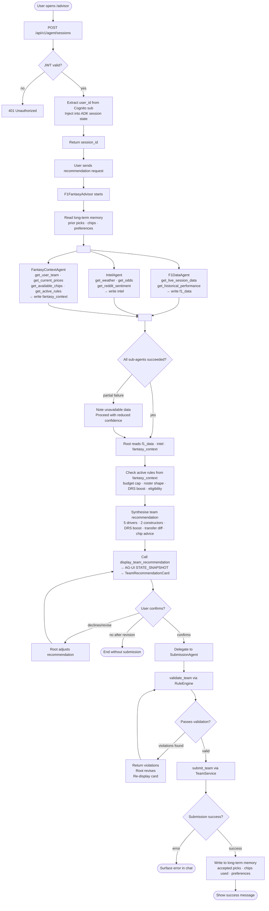
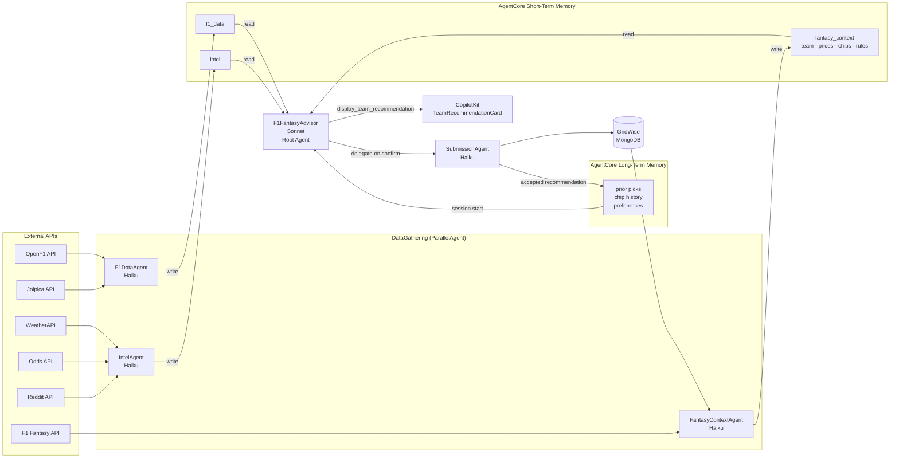
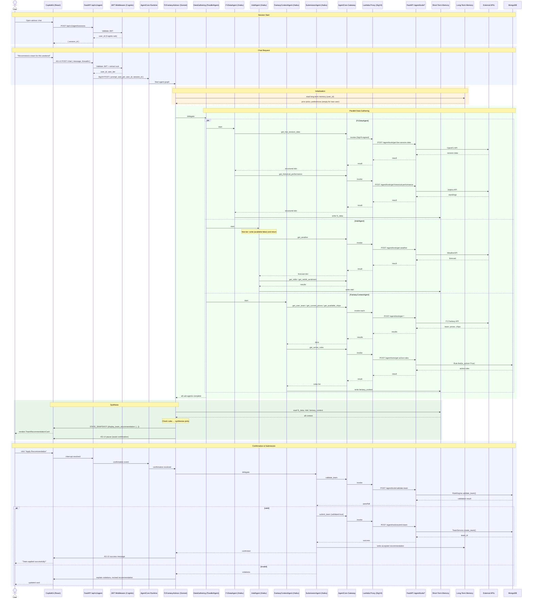

# GridWise — Project Documentation

> **Prepared:** 2026-06-04  
> **Branch:** feat/presentation-slides  
> **Purpose:** Source of truth for slide deck. Every claim is traceable to code or specs.

---

## 1. Project Overview

**GridWise** is an AI-powered Formula 1 Fantasy team management platform. It helps users compose, validate, and optimise their F1 Fantasy teams by combining live race telemetry, betting odds, community sentiment, and rule-aware AI recommendations — all surfaced through a conversational advisor.

**The core problem it solves:** F1 Fantasy users must make complex weekly team decisions (5 drivers + 2 constructors, DRS boost, chip usage) across a $100M budget cap while tracking live price changes, form, and track-specific conditions. GridWise automates the data gathering and applies AI reasoning to surface a rules-compliant, data-backed recommendation — and lets the user apply it in one click.

**Key capabilities:**
- Create and manage F1 Fantasy teams with real-time budget validation
- Configurable rules engine (budget cap, roster size, DRS boost, eligibility, transfers)
- AI Advisor: a multi-agent system that gathers live F1 data, external intelligence, and user context in parallel before synthesising a recommendation
- One-click team submission from the advisor chat (with rule validation gating)
- Tier-based feature access (free vs. premium intelligence tools)

---

## 2. Architecture

### High-Level System Design

```
┌─────────────────────────────────────────────────────────────────┐
│  Browser (React + CopilotKit)                                   │
│  Pages: Dashboard · Team CRUD · Rules Admin · AI Advisor Chat   │
└──────────────────────┬──────────────────────────────────────────┘
                       │ HTTPS + JWT (Cognito)
                       ▼
┌─────────────────────────────────────────────────────────────────┐
│  FastAPI Service (Python 3.12)                                  │
│  Routers: drivers · constructors · teams · rules · agent        │
│  Services: TeamService · RuleEngine · TransferService           │
│  Agent: agents.py · gateway.py · memory.py · session.py         │
└──────┬────────────┬──────────────────────────────┬─────────────┘
       │            │                              │
       ▼            ▼                              ▼
  MongoDB      AWS Cognito              AgentCore Runtime
  (Teams,      (JWT validation,        (BedrockAgentCoreApp,
   Rules,       user pool,             runs F1 agent graph,
   Drivers,     custom:tier)           SigV4-invoked by FastAPI)
   Constructors)
                                               │
                               ┌───────────────┴───────────────┐
                               ▼                               ▼
                    AgentCore Gateway               AgentCore Memory
                    (tool host, JWT auth,           (session + long-term
                     semantic discovery,             stores)
                     11 tools via Lambda proxy)
                               │
                               ▼
                    Lambda (tools proxy)
                    (SigV4-signs requests → FastAPI
                     /api/v1/agent/tools/* endpoints)
                               │
              ┌────────────────┴──────────────────┐
              ▼                                   ▼
     External APIs                       GridWise Internal
     (OpenF1, Jolpica,                   (RuleEngine, TeamService,
      WeatherAPI, Odds API,               MongoDB via FastAPI)
      Reddit, F1 Fantasy API)
```

### AWS Architecture Diagram

> **Note:** React frontend and FastAPI service are run locally / not yet deployed to cloud hosting. Placeholder boxes shown with dashed borders.

```mermaid
graph TB
    subgraph Client["Client (Local — not yet deployed)"]
        UI["⬜ React Frontend\n(Vite · CopilotKit)\nlocalhost:5173"]
    end

    subgraph FastAPI_Box["FastAPI Service (Local — not yet deployed)"]
        API["⬜ FastAPI\n(Python 3.12)\nlocalhost:8000"]
    end

    subgraph AWS["AWS (us-east-1)"]
        subgraph Auth["Authentication"]
            Cognito["🔐 Amazon Cognito\nUser Pool\ncustom:tier claim"]
        end

        subgraph Storage["Storage"]
            MongoDB["🗄️ MongoDB\n(self-hosted)\nTeams · Rules · Drivers"]
            Secrets["🔑 Secrets Manager\nWeatherAPI · OddsAPI\nReddit · F1 credentials"]
            SSM["📋 SSM Parameter Store\nEndpoints · IDs · ARNs"]
        end

        subgraph IAM_box["IAM"]
            Roles["👤 IAM Roles\nfastapi-service-role\ngateway-service-role\nagent-runtime-role"]
        end

        subgraph ECR_box["Container Registry"]
            ECR["📦 ECR\ngridwise-agent-runtime\n(agent graph image)"]
        end

        subgraph AgentCore["AWS Bedrock AgentCore"]
            Runtime["🤖 AgentCore Runtime\ngridwise_agent_runtime\nBedrockAgentCoreApp\n(F1 advisor graph)"]
            Gateway["🔀 AgentCore Gateway\ngridwise-agent-gateway\nJWT Cognito authoriser\nSemantic tool discovery"]
            Memory["🧠 AgentCore Memory\nSession store 30d\nLong-term store 90d"]
        end

        subgraph Lambda_box["Lambda"]
            LambdaProxy["λ gridwise-tools-proxy\nSigV4 signs requests\nGateway → FastAPI"]
            RuntimeCR["λ RuntimeCrHandler\nCDK Custom Resource\nCreates AgentCore Runtime"]
        end

        subgraph Bedrock["Amazon Bedrock"]
            Sonnet["Claude 3.5 Sonnet\n(root agent)"]
            Haiku["Claude 3 Haiku\n(sub-agents)"]
        end
    end

    subgraph External["External APIs"]
        OpenF1["OpenF1 API\n(live session data)"]
        Jolpica["Jolpica API\n(standings)"]
        WeatherAPI["WeatherAPI\n(forecast) PREMIUM"]
        OddsAPI["The Odds API\n(race odds) PREMIUM"]
        Reddit["Reddit API\n(sentiment) PREMIUM"]
        F1Fantasy["F1 Fantasy API\n(team · prices · chips)"]
    end

    %% User → Frontend → FastAPI
    UI -->|"HTTPS + JWT"| API
    API -->|"JWT validation"| Cognito
    API -->|"team/rule data"| MongoDB
    API -->|"SigV4 POST\n/api/v1/agent/chat"| Runtime

    %% AgentCore Runtime → Gateway → Lambda → FastAPI tools
    Runtime -->|"semantic discovery\n+ JWT tier filter"| Gateway
    Runtime <-->|"session + LTM"| Memory
    Gateway -->|"invoke"| LambdaProxy
    LambdaProxy -->|"SigV4-signed POST\n/api/v1/agent/tools/*"| API

    %% FastAPI tools → external APIs
    API --> OpenF1
    API --> Jolpica
    API --> WeatherAPI
    API --> OddsAPI
    API --> Reddit
    API --> F1Fantasy

    %% Secrets & config
    API -->|"get secrets"| Secrets
    API -->|"get params"| SSM
    Runtime -->|"get params"| SSM

    %% Bedrock models
    Runtime -->|"InvokeModel"| Sonnet
    Runtime -->|"InvokeModel"| Haiku

    %% ECR → Runtime
    ECR -->|"container image"| Runtime

    %% CDK custom resource
    RuntimeCR -->|"creates runtime"| Runtime

    %% Styling
    classDef placeholder fill:#f5f5f5,stroke:#999,stroke-dasharray:5 5,color:#666
    classDef aws fill:#FF9900,stroke:#c47700,color:#fff
    classDef agentcore fill:#7B2FBE,stroke:#5a1f8c,color:#fff
    classDef bedrock fill:#01A88D,stroke:#017a67,color:#fff
    classDef external fill:#e8f5e9,stroke:#2e7d32,color:#333
    classDef lambda fill:#FF9900,stroke:#c47700,color:#fff

    class UI,API placeholder
    class Cognito,MongoDB,Secrets,SSM,Roles,ECR aws
    class Runtime,Gateway,Memory agentcore
    class Sonnet,Haiku bedrock
    class OpenF1,Jolpica,WeatherAPI,OddsAPI,Reddit,F1Fantasy external
    class LambdaProxy,RuntimeCR lambda
```



### Key Components

| Component | Technology | Responsibility |
|-----------|-----------|----------------|
| Frontend | React 19 + TypeScript + Vite | UI, chat interface, team management |
| API Server | FastAPI + Python 3.12 | Business logic, auth, agent entry point |
| Database | MongoDB 6 + Beanie ODM | Teams, rules, drivers, constructors |
| Auth | AWS Cognito | JWT issuance + validation; `custom:tier` claim |
| Agent Graph | Google ADK + LiteLLM | Multi-agent orchestration, Claude via Bedrock |
| AgentCore Gateway | AWS Bedrock AgentCore | Tool hosting, JWT-based tier filtering, semantic discovery |
| AgentCore Runtime | AWS Bedrock AgentCore | Containerised agent execution environment |
| AgentCore Memory | AWS Bedrock AgentCore | Session-scoped + long-term user memory |
| Lambda Proxy | Python 3.12 | SigV4-signs Gateway → FastAPI tool calls |
| Infrastructure | AWS CDK (TypeScript) | Foundation stack (IAM, Cognito, Secrets) + Agent stack |

---

## 3. Agent Design

### 3.1 Agent Roles

| Agent | Model | Role | Memory |
|-------|-------|------|--------|
| `F1FantasyAdvisor` | Claude 3.5 Sonnet (Bedrock) | Root orchestrator; synthesises recommendation | Reads long-term at session start |
| `DataGathering` | — (ParallelAgent) | Runs F1DataAgent, IntelAgent, FantasyContextAgent concurrently | — |
| `F1DataAgent` | Claude 3 Haiku (Bedrock) | Fetches live session data + historical standings | Writes `f1_data` → short-term memory |
| `IntelAgent` | Claude 3 Haiku (Bedrock) | Fetches weather, odds, Reddit sentiment (premium) | Writes `intel` → short-term memory |
| `FantasyContextAgent` | Claude 3 Haiku (Bedrock) | Fetches user team, prices, chips, active rules | Writes `fantasy_context` → short-term memory |
| `SubmissionAgent` | Claude 3 Haiku (Bedrock) | Validates + submits team; writes accepted pick to long-term memory | Writes `recommendation_accepted` → long-term memory |

### 3.2 Activity Diagram

> **Verified against code:** Accurate. The `display_team_recommendation` tool call is converted to an AG-UI `STATE_SNAPSHOT` event in `agent.py:_adk_event_to_ag_ui()`, which triggers the `TeamRecommendationCard` render in CopilotKit. The parallel fork maps directly to `ParallelAgent` in `agents.py:_build_data_gathering_agent()`.



### 3.3 Data Flow Diagram



### 3.4 Full Session Sequence Diagram

> **Verified against code:** The Lambda proxy SigV4 signing step (Gateway → Lambda → FastAPI) is confirmed in `gridwise-agent-stack.ts` and `tools_proxy` Lambda. The Runtime invocation uses SigV4 in `agent.py:_invoke_runtime()` with `botocore.auth.SigV4Auth`. The fallback to direct ADK runner for local dev (when no Runtime endpoint is configured) is present in `agent.py:_stream_ag_ui()`.



---

## 4. Core Modules & Code Walkthrough

### Frontend (`app/src/`)

| File / Directory | Purpose |
|-----------------|---------|
| `pages/Advisor.tsx` | AI advisor chat page; mounts CopilotKit chat and wires to `/api/v1/agent/chat` |
| `pages/Dashboard.tsx` | Lists user's fantasy teams |
| `pages/RulesAdmin.tsx` | Rule management: create, toggle, delete; filter by type/status |
| `pages/TeamCreate.tsx` / `TeamEdit.tsx` | Team builder with driver/constructor selectors and real-time budget display |
| `components/advisor/AdvisorChat.tsx` | CopilotKit `<CopilotChat>` wrapper; handles SSE streaming |
| `components/advisor/TeamRecommendationCard.tsx` | Renders structured recommendation from `STATE_SNAPSHOT`; "Apply Recommendation" button |
| `components/rules/RuleCard.tsx` | Displays a single rule with severity badge, active toggle, delete action |
| `stores/authStore.ts` | Zustand store: JWT, user_id, login/logout actions |
| `stores/teamStore.ts` | Zustand store: team list, CRUD actions |
| `api/client.ts` | Axios instance with `Authorization: Bearer` header injection |

### Backend (`service/app/`)

| File / Directory | Purpose |
|-----------------|---------|
| `main.py` | FastAPI app factory; registers routers; startup event pings AgentCore Gateway |
| `config.py` | `pydantic-settings` `Settings` class; reads env vars with defaults |
| `auth.py` | Cognito JWT validation middleware (`get_current_user` FastAPI dependency); `get_user_tier()` reads `custom:tier` claim |
| `database.py` | Motor async client init; Beanie ODM document registration |
| `models/rule.py` | `Rule` Beanie document with `RuleType` enum and `ValidationLogic` sub-model |
| `models/team.py` | `FantasyTeam` document; `DriverSelection` / `ConstructorSelection` embedded docs |
| `routers/agent.py` | `POST /agent/sessions` (session creation) and `POST /agent/chat` (AG-UI SSE stream); SigV4 invocation of AgentCore Runtime; fallback to direct ADK runner for local dev |
| `routers/agent_tools.py` | 11 tool endpoints (`/agent/tools/*`); IAM SigV4 auth dependency (`verify_iam_sigv4`); one endpoint per tool |
| `routers/rules.py` | CRUD + `PATCH /rules/{id}/toggle` + `DELETE /rules/{id}` (soft-delete) |
| `routers/teams.py` | Team CRUD; validation on create/update via `RuleEngine` |
| `services/rule_engine.py` | Loads active rules from DB; instantiates strategy validators; aggregates violations by severity |
| `services/rules/` | One class per `RuleType`; all inherit `AbstractRule`; `validate(team)` returns `List[RuleViolation]` |
| `agent/agents.py` | `build_f1_advisor_graph(user_jwt, user_id)` — constructs full ADK agent graph; wires `AgentCoreGateway`, `AgentCoreSessionService`, `AgentCoreMemoryService` into `Runner` |
| `agent/gateway.py` | `AgentCoreGateway` — loads endpoint from env/SSM; `get_toolset_for_agent(agent_name, discovery_query)` returns `MCPToolset` with `Authorization: Bearer <jwt>` header |
| `agent/memory.py` | `AgentCoreMemoryService` — implements ADK `BaseMemoryService`; wraps `MemoryClient.create_event()`, `retrieve_memories()`, `get_last_k_turns()` |
| `agent/session.py` | `AgentCoreSessionService` — implements ADK `BaseSessionService`; uses AgentCore session memory store |
| `agent/tools/f1_data.py` | `get_live_session_data()` (OpenF1), `get_historical_performance()` (Jolpica) |
| `agent/tools/intelligence.py` | `get_weather()`, `get_odds()`, `get_reddit_sentiment()` — API keys from Secrets Manager |
| `agent/tools/fantasy.py` | `get_user_team()`, `get_current_prices()`, `get_available_chips()`, `get_active_rules()` |
| `agent/tools/submission.py` | `validate_team()` (RuleEngine), `submit_team()` (TeamService) |
| `agent/lambda/tools_proxy/` | Lambda handler: receives Gateway invocation → SigV4-signs request → forwards to FastAPI tool endpoint |
| `agent/lambda/runtime_cr/index.py` | CDK Custom Resource handler: creates/updates AgentCore Runtime via `bedrock-agentcore-control` SDK; writes Runtime endpoint to SSM |

### Infrastructure (`service/infra/`)

| File | Purpose |
|------|---------|
| `gridwise-foundation-stack.ts` | Cognito User Pool + Client (`custom:tier` attribute); IAM roles (FastAPI, Gateway, AgentRuntime); Secrets Manager (4 API secrets); ECR; SSM params; `CfnOutput` exports |
| `gridwise-agent-stack.ts` | Imports Foundation outputs; Lambda tools proxy; AgentCore Gateway (JWT Cognito authoriser, 11 tool schemas); AgentCore Runtime (CDK Custom Resource); SSM params; `CfnOutput` |

---

## 5. Data Models & Schemas

### Driver
```python
class Driver(Document):
    driver_id: str          # UUID
    first_name: str
    last_name: str
    team_name: str          # Constructor name
    nationality: str
    driver_number: int
    price: float            # millions
    status: "active" | "inactive" | "reserve"
    price_history: List[{"price": float, "timestamp": datetime}]
```

### Constructor
```python
class Constructor(Document):
    constructor_id: str
    name: str               # short (e.g. "Red Bull")
    full_name: str
    nationality: str
    price: float
    status: "active" | "inactive"
    price_history: List[{"price": float, "timestamp": datetime}]
```

### Rule
```python
class Rule(Document):
    rule_id: str
    rule_type: RuleType     # budget_cap | roster_size | drs_boost_required |
                            # max_teams_per_user | transfer_limit | driver_eligibility
    name: str
    description: str
    config: Dict[str, Any]  # rule-specific, e.g. {"max_budget": 100.0}
    validation_logic: ValidationLogic   # operator, field, threshold, error_template
    severity: "error" | "warning" | "info"
    is_active: bool
    applies_to: "team" | "user" | "driver"
    effective_from: Optional[datetime]
    effective_until: Optional[datetime]
    created_by: str
```

### FantasyTeam
```python
class FantasyTeam(Document):
    team_id: str
    team_name: str
    created_by: str         # Cognito sub (user_id)
    season: int
    drivers: List[DriverSelection]      # 5 drivers with snapshot prices
    constructors: List[ConstructorSelection]  # 2 constructors
    drs_boost_driver_id: Optional[str]
    budget_cap: float       # default 100.0
    budget_used: float
    budget_remaining: float
    transfer_history: List[TransferRecord]
    current_race_transfers: int
    available_transfers: int  # default 2
    is_valid: bool
    validation_errors: List[dict]
    is_active: bool
```

### Validation Result
```python
class TeamValidationResult(BaseModel):
    team_id: str
    status: "valid" | "invalid" | "warning"
    is_valid: bool
    violations: List[RuleViolation]   # severity="error"
    warnings: List[RuleViolation]     # severity="warning"
    info: List[RuleViolation]         # severity="info"
    summary: Dict[str, Any]
```

### Agent Tool API Contract (tool endpoints)

All 11 tool endpoints live under `POST /api/v1/agent/tools/{tool-name}` and require an AWS SigV4 `Authorization` header (enforced by `verify_iam_sigv4` dependency). Selected schemas:

```
POST /agent/tools/validate-team
Body: { "team": {...}, "user_team_count": 0 }
Response: TeamValidationResult

POST /agent/tools/submit-team
Body: { "team": {...}, "validated": true, "session_state": {...} }
Returns HTTP 422 if validated != true

POST /agent/tools/get-weather
Body: { "circuit_location": "Monaco" }

POST /agent/tools/get-reddit-sentiment
Body: { "race_name": "Monaco Grand Prix" }
```

### Chat API Contract

```
POST /api/v1/agent/chat
Headers: Authorization: Bearer <cognito-jwt>
Body: {
  "threadId": "uuid",
  "runId": "uuid",
  "messages": [{"id": "uuid", "role": "user", "content": "..."}],
  "actions": [], "agentSession": null, "agentStates": [],
  "extensions": {}, "textEnabled": true, "imageEnabled": false
}

Response: text/event-stream (AG-UI protocol)
data: {"type": "RUN_STARTED", "threadId": "...", "runId": "..."}
data: {"type": "TEXT_MESSAGE_START", "messageId": "...", "role": "assistant"}
data: {"type": "TEXT_MESSAGE_CONTENT", "messageId": "...", "delta": "..."}
data: {"type": "STATE_SNAPSHOT", "snapshot": {"display_team_recommendation": {...}}}
data: {"type": "TEXT_MESSAGE_END", "messageId": "..."}
data: {"type": "RUN_FINISHED", "threadId": "...", "runId": "..."}
```

---

## 6. Configuration & Environment

### Backend `.env`

```bash
# MongoDB
MONGODB_URL=mongodb://localhost:27017
MONGODB_DB_NAME=gridwise_mvp

# Cognito
COGNITO_USER_POOL_ID=us-east-1_xxxxx
COGNITO_APP_CLIENT_ID=xxxxxxxxxx
AWS_REGION=us-east-1
AUTH_BYPASS=false       # local dev only — NEVER true in production

# CORS
BACKEND_CORS_ORIGINS=["http://localhost:5173"]

# AgentCore (populated by CDK / SSM at runtime)
AGENTCORE_GATEWAY_ENDPOINT=   # falls back to SSM /gridwise/agentcore/gateway-endpoint
AGENTCORE_RUNTIME_ENDPOINT=   # falls back to SSM /gridwise/agentcore/runtime-endpoint
AGENTCORE_MEMORY_ID=          # falls back to SSM /gridwise/agentcore/memory-id
AGENTCORE_SESSION_MEMORY_ID=  # falls back to SSM /gridwise/agentcore/session-memory-id
```

### Frontend `.env`

```bash
VITE_API_BASE_URL=http://localhost:8000/api/v1
```

### AWS Secrets Manager

| Secret ID | Contents |
|-----------|----------|
| `gridwise/weather-api-key` | WeatherAPI key |
| `gridwise/odds-api-key` | The Odds API key |
| `gridwise/reddit-credentials` | Reddit OAuth client_id + client_secret |
| `gridwise/f1-credentials` | F1 Fantasy account username + password |

### SSM Parameter Store

| Parameter | Value |
|-----------|-------|
| `/gridwise/cognito/user-pool-id` | Cognito User Pool ID |
| `/gridwise/cognito/app-client-id` | Cognito App Client ID |
| `/gridwise/service/fastapi-base-url` | FastAPI base URL (localhost or App Runner) |
| `/gridwise/agentcore/gateway-endpoint` | AgentCore Gateway MCP URL |
| `/gridwise/agentcore/runtime-endpoint` | AgentCore Runtime invocation URL |
| `/gridwise/agentcore/memory-id` | Long-term memory store ID |
| `/gridwise/agentcore/session-memory-id` | Session memory store ID |
| `/gridwise/iam/fastapi-role-arn` | FastAPI IAM role ARN |
| `/gridwise/iam/agent-runtime-role-arn` | Agent Runtime IAM role ARN |

### Infrastructure Stacks

```bash
cd service/infra
cdk deploy GridwiseFoundationStack   # IAM, Cognito, Secrets, ECR
cdk deploy GridwiseAgentStack        # Gateway, Runtime, Lambda proxy
```

AgentCore Memory stores are created separately (CDK L2 construct causes stuck state on rollback):
```bash
python scripts/create_memory_resources.py
```

---

## 7. Key Decisions & Trade-offs

### 1. User ID never an LLM argument
`user_id` is extracted from the Cognito JWT in FastAPI middleware and injected directly into the ADK session state. Tools read it from `session_state` — the LLM never sees or receives it as a tool argument. This prevents prompt injection attacks from escalating to cross-user data access.

### 2. Rules checked before synthesis
`FantasyContextAgent` fetches active rules during data gathering and writes them to `fantasy_context` in short-term memory. The root agent reads them before proposing any picks. This eliminates the common validate→revise loop: the agent knows the constraints before it reasons, so validation at submission time is a safety net for edge cases (price drift, arithmetic errors) rather than primary constraint enforcement.

### 3. Parallel data gathering
Three sub-agents (`F1DataAgent`, `IntelAgent`, `FantasyContextAgent`) run concurrently via ADK `ParallelAgent`. This reduces total latency from ~15–20s sequential to ~5–10s. Sub-agents write to session memory; the root agent reads after all three complete.

### 4. Long-term memory written only on accepted submissions
Past picks, chip usage, and stated preferences are persisted only after `submit_team` succeeds. Cancelled or rejected recommendation sessions do not write to long-term memory, keeping the history clean and reflecting only confirmed decisions.

### 5. Tier-based tool filtering via Gateway JWT
The user's Cognito JWT (which carries `custom:tier`) is forwarded to the AgentCore Gateway as a Bearer token. The Gateway uses it to filter which tools are available to each sub-agent via semantic discovery. Free-tier users get 8 tools; premium gets all 11 (weather, odds, Reddit added). If intelligence tools are absent, `IntelAgent` writes `{available: false}` and the root agent degrades gracefully.

### 6. CDK two-stack split
Infrastructure is split into `GridwiseFoundationStack` (Cognito, IAM, Secrets, ECR) and `GridwiseAgentStack` (Gateway, Runtime, Lambda). Foundation deploys first; Agent stack imports its outputs via `Fn.importValue`. This allows updating agent infrastructure without touching auth/identity resources, and keeps the auth surface stable.

### 7. AgentCore Memory created via script, not CDK
The CDK L2 `agentcore.Memory` construct causes a stuck `CREATING` state during CloudFormation rollback. Memory resources are created via `scripts/create_memory_resources.py` (idempotent) and their IDs are stored in SSM for runtime lookup.

### 8. SigV4 Lambda proxy for tool calls
The AgentCore Gateway invokes tools via Lambda, not directly over HTTPS. The Lambda handler uses `botocore.auth.SigV4Auth` to sign each outgoing request with the Lambda execution role's credentials before forwarding to FastAPI's `/agent/tools/*` endpoints. FastAPI verifies the `AWS4-HMAC-SHA256` Authorization header, ensuring only the Gateway can call tool endpoints.

### 9. Strategy pattern for rule engine
Each rule type has its own validator class inheriting `AbstractRule`. `RuleEngine` loads active rules from MongoDB and instantiates the corresponding validator via a `RULE_VALIDATORS` registry dict. New rule types require only a new class + one registry entry — no changes to the orchestration layer.

### 10. Soft deletes throughout
Rules and teams are deactivated (`is_active=False`) rather than hard-deleted. This maintains an audit trail, supports recovery, and enables historical analysis without tombstone records.

---

## 8. Open Questions / Gaps

### Deployment incomplete (tasks 13–14 in OpenSpec)
`GridwiseAgentStack` CDK deploy (task 13) and secret population (task 14) are not yet verified. The App Runner construct is commented out with a note that it's not available on the free tier — the `fastapi-base-url` SSM parameter defaults to `http://localhost:8080`. End-to-end testing (task 19) depends on these being completed.

### Tool implementations need live credentials testing
`intelligence.py` tools (weather, odds, Reddit) and `fantasy.py` F1 Fantasy API tools have not been tested against real API credentials. The tool schemas are complete and endpoints exist, but API-specific edge cases (rate limits, auth token refresh for F1 Fantasy) are unvalidated.

### No streaming from AgentCore Runtime
The `_invoke_runtime()` function in `agent.py` collects the full response before yielding it as a single `TEXT_MESSAGE_CONTENT` delta. The current runtime invocation API (`bedrock-agentcore`) may not support token-level streaming — if it does, the endpoint should be updated to yield deltas progressively rather than buffering.

### Frontend–backend type sync is manual
Frontend TypeScript types in `app/src/types/` are hand-maintained alongside backend Pydantic schemas. There is no OpenAPI code generation. Divergence is a latent risk, particularly for the `TeamRecommendationCard` data shape passed via `STATE_SNAPSHOT`.

### AgentCore Memory integration not yet validated end-to-end
`AgentCoreSessionService` and `AgentCoreMemoryService` are implemented but have not been exercised against live AgentCore Memory resources. The `_persist_session_callback` in `agents.py` calls `memory_service.add_session_to_memory()` — this path needs an integration test with real memory IDs in SSM.

### No e2e or integration tests for agent flows
There are unit tests for the rule validators and some API endpoints, but no integration tests covering the agent graph, tool invocation chain, or memory read/write cycle. The parallel data gathering, tier filtering, and submission flow lack automated coverage.

### `display_team_recommendation` tool not registered in Gateway schemas
The `STATE_SNAPSHOT` event is triggered when the root agent calls `display_team_recommendation`. This tool is handled client-side by `_adk_event_to_ag_ui()` in `agent.py` — it is not a Gateway-registered tool. It should be documented as an internal ADK function call, not a tool endpoint, to avoid confusion when auditing the Gateway tool list.

### App Runner skipped on free tier
`gridwise-agent-stack.ts` explicitly notes App Runner is skipped and the FastAPI base URL defaults to `http://localhost:8080`. For production deployment, either App Runner must be re-enabled or an alternative hosting strategy (ECS Fargate, EC2) must be chosen and the Lambda proxy's `FASTAPI_BASE_URL` updated accordingly.
